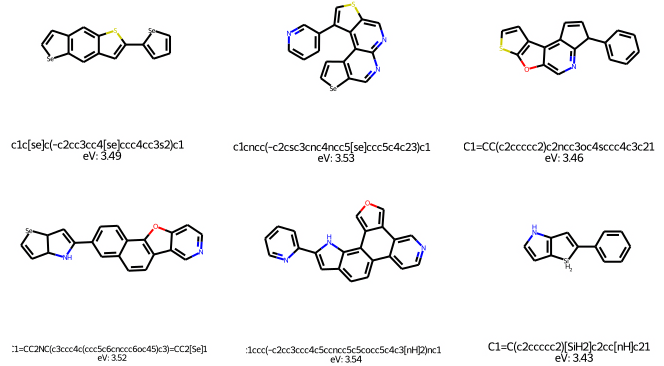

# HierCVAE: Hierarchical Conditional Variational Autoencoder

_Raul Ortega Ochoa_


## About
------------------------------

The base HierVAE model from _(1)_ is modified to allow for conditional, controlled generation of molecules given a value of the desired property (HierCVAE). Here the property chosen is the electron band gap (eV).

To verify the quality of the generated molecules with respect to the property targeted a surrogate model _(2)_ is trained to predict the electron band gap given the molecules.


_This project has received funding from the European Union’s Horizon 2020 research and innovation programme under grant agreement No 957189. The project is part of BATTERY 2030+, the large-scale European research initiative for inventing the sustainable batteries of the future._

## Input & Output
------------------------------

* *Input*: Desired electron band gap (eV) of the generated molecules (range 2.0-4.2 eV)

* *Output*: Molecules generated (img) with SMILES representation and predicted electron band gap by the surrogate model.

## Installation & Usage
------------------------------

### Conda:
1. Clone the repository: ```git clone https://github.com/raulorteg/HierCVAE-demo```
2. Create a conda environment using the yaml file: ```conda env create -f environment.yaml```
3. Activate environment: ```conda activate cvae```

3. Run the main script: ```python main.py --cond=2.6```

### Docker:
1. Clone the repository: ```git clone https://github.com/raulorteg/HierCVAE-demo```
2. Build the image: ```sudo docker build --tag="hiercvae:demo"```
3. Run main script on the image: ```sudo docker run -it --rm hiercvae:demo --cond=2.0```

## Requirements
------------------------------

see the ```environment.yaml``` file

## License
Apache License


## Dataset
------------------------------
The current version is trained on a subset of 200k molecules from the The Harvard organic photovoltaic dataset : https://www.nature.com/articles/sdata201686#Sec7, _(3)_.

The property chosen for the controlled generation of molecules is the electron band gap. The subset comprises molecules between 2.0-4.2 eV electron band gap, so the model is expected to work more reliable within this bounds.


## References
------------------------------

_(1). Jin, Wengong & Barzilay, Regina & Jaakkola, Tommi. (2020). Hierarchical Generation of Molecular Graphs using Structural Motifs._

_(2). Tsubaki, Masashi & Tomii, Kentaro & Sese, Jun. (2018). Compound-protein Interaction Prediction with End-to-end Learning of Neural Networks for Graphs and Sequences. Bioinformatics (Oxford, England). 35. 10.1093/bioinformatics/bty535._

_(3). Lopez, S., Pyzer-Knapp, E., Simm, G. et al. The Harvard organic photovoltaic dataset. Sci Data 3, 160086 (2016). https://doi.org/10.1038/sdata.2016.86_
